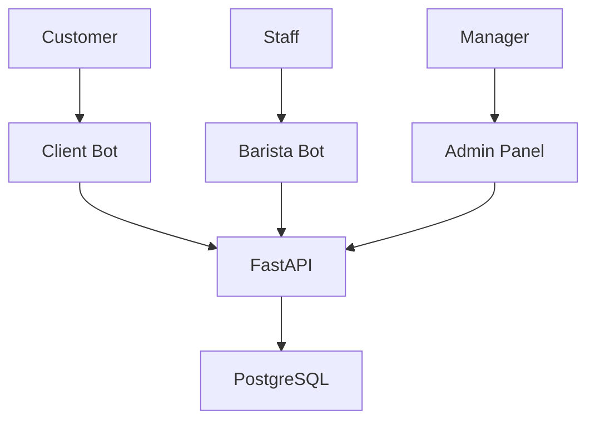

# ☕ Loyalty System

**Enterprise-level loyalty system for coffee shops with Telegram bots and web admin panel**

[](https://python.org)
[](https://fastapi.tiangolo.com)
[](https://docker.com)
[](#)

## 🚀 Quick Start

```bash
# 1. Clone and setup
git clone <repository> loyalty-system
cd loyalty-system
cp .env.example .env

# 2. Add bot tokens to .env
# Get tokens from @BotFather on Telegram

# 3. Deploy (auto-setup everything)
./scripts/deploy.sh prod
```

**Ready in 3 minutes!** ⚡

## ✨ Features

### 📱 **Client Bot**
- User registration with phone verification
- Points balance and loyalty levels
- Payment code generation (90s validity)
- Feedback system with ratings
- Birthday gifts automation

### 👨‍💼 **Barista Bot**  
- Order processing via payment codes
- Gift management (create/redeem)
- Customer notifications (mass/individual)
- Operation history tracking

### 🖥️ **Admin Panel**
- User management dashboard
- Order history and analytics
- Gift tracking and reports
- Feedback and ideas overview
- Real-time statistics

### 🏆 **Loyalty System**
- **4 Levels**: Standard → Silver → Gold → Platinum  
- **Auto Points**: 1 point per 100 rubles
- **Smart Upgrades**: Automatic level progression
- **Birthday Rewards**: Auto-detection and gifts

## 🛠️ Tech Stack

- **Backend**: FastAPI, PostgreSQL, SQLAlchemy, Alembic
- **Bots**: aiogram 3.x with async handling
- **Infrastructure**: Docker, Docker Compose
- **Security**: Rate limiting, CORS, environment configs
- **Monitoring**: Health checks, structured logging

## 📊 System Overview



## 🔧 Architecture

```
loyalty-system/
├── api/                 # FastAPI backend
├── client_bot/          # Customer Telegram bot
├── barista_bot/         # Staff Telegram bot  
├── admin_panel/         # Web management interface
├── common/              # Shared models & utilities
├── migrations/          # Database migrations
├── scripts/             # Deployment & backup tools
└── tests/               # Test suite
```

## 🌐 Access Points

| Service | URL | Description |
|---------|-----|-------------|
| **API Docs** | `localhost:8000/docs` | Interactive API documentation |
| **Admin Panel** | `localhost:8000` | Management dashboard |
| **Client Bot** | `@your_client_bot` | Customer interface |
| **Barista Bot** | `@your_barista_bot` | Staff interface |

## 🔒 Security

- **Rate Limiting**: 5 registrations/min, 30 profile requests/min
- **Environment-based CORS**: Secure production settings
- **Input Validation**: Comprehensive request validation
- **Error Handling**: Graceful failure with user-friendly messages

## 📦 Deployment

### Development
```bash
./scripts/deploy.sh dev
```

### Production
```bash
./scripts/deploy.sh prod
```

### Manual Setup
```bash
docker-compose up --build -d
docker-compose exec api alembic upgrade head
```

## 💾 Backup & Restore

```bash
# Create backup
./scripts/backup.sh

# Restore from backup
./scripts/restore.sh backups/backup_20241219_120000.sql.gz
```

## 📋 Configuration

Copy `.env.example` to `.env` and configure:

```env
# Telegram Bot Tokens (from @BotFather)
TELEGRAM_TOKEN_CLIENT=your_client_bot_token
TELEGRAM_TOKEN_BARISTA=your_barista_bot_token

# Admin Credentials
ADMIN_LOGIN=admin
ADMIN_PASSWORD=secure_password

# Database
POSTGRES_PASSWORD=secure_db_password
```

## 🔍 Monitoring

### Logs
```bash
# All services
docker-compose logs -f

# Specific service  
docker-compose logs -f api
```

### Health Checks
```bash
# Service status
docker-compose ps

# API health
curl http://localhost:8000/analytics/summary
```

## 📚 API Documentation

Full interactive documentation available at `/docs` endpoint.

### Key Endpoints
- `POST /users/` - User registration
- `POST /codes/generate` - Generate payment code
- `POST /orders/` - Process order
- `GET /analytics/summary` - System statistics

## 🧪 Testing

```bash
# Run tests
docker-compose run api pytest

# Load test data
docker-compose run api python tests/fixtures.py
```

## 🚀 Production Checklist

- [ ] Update bot tokens in `.env`
- [ ] Change admin password
- [ ] Configure CORS domains in `api/main.py`
- [ ] Set up SSL/HTTPS
- [ ] Configure backup schedule
- [ ] Set up monitoring

## 📄 License

This project is licensed under the MIT License.

## 🤝 Contributing

1. Fork the project
2. Create feature branch (`git checkout -b feature/amazing-feature`)
3. Commit changes (`git commit -m 'Add amazing feature'`)
4. Push to branch (`git push origin feature/amazing-feature`)
5. Open Pull Request

## 📞 Support

- **Documentation**: See `PRODUCTION_README.md` for detailed setup
- **Issues**: Create GitHub issue for bugs/features
- **Logs**: Check `logs/` directory for troubleshooting

---

<div align="center">

**Built with ❤️ for coffee shops worldwide**

[Documentation](PRODUCTION_README.md) • [API Docs](http://localhost:8000/docs) • [Issues](../../issues)

</div>